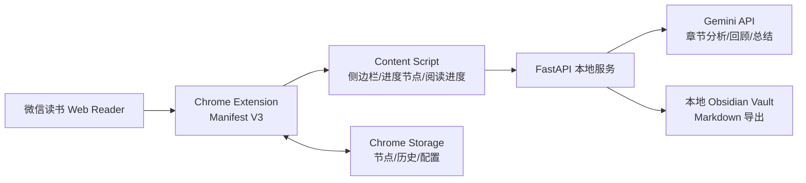

# WeRead AI 架构说明

```mermaid
flowchart LR
    A[微信读书 Web Reader] --> B[Chrome Extension\nManifest V3]
    B --> C[Content Script\n侧边栏/进度节点/阅读进度]
    B <--> D[Chrome Storage\n节点/历史/配置]
    C --> E[FastAPI 本地服务]
    E --> F[Gemini API\n章节分析/回顾/总结]
    E --> G[本地 Obsidian Vault\nMarkdown 导出]
```

## 边界设计

浏览器扩展负责页面感知、交互和轻量状态；FastAPI 负责 AI 调用、结构化输入输出和 Markdown 生成；Obsidian 只作为用户可控的本地沉淀出口。API Key 只从服务端环境变量读取，不进入扩展代码或请求参数。

